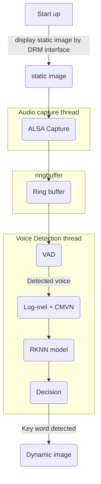

# VoiceWakeOn

## Description
This project implements a lightweight keyword spotting(KWS) system running on RK3568(or similar rockchip system). 
The project is based on C/C++.

### Overview
The system includes:

- Real-time steaming audio pipeline by ALSA
- Voice Activity Detection
- Log-Mel feature extraction
- CMVN normalization
- RKNN model inference
- Image playing by DRM

### Sample
[video description]("docs/rk3568_demo.mp4")

### workflow



## Getting Started

### Dependencies
- ALSA
- RKNN Toolkit
- GCC (arm-linux-gnueabihf)
- CMake

### compile
```shell
./make.sh
```

### run
```shell
./build/voice_cap
```

***A practice project,  for leaning purpose only***